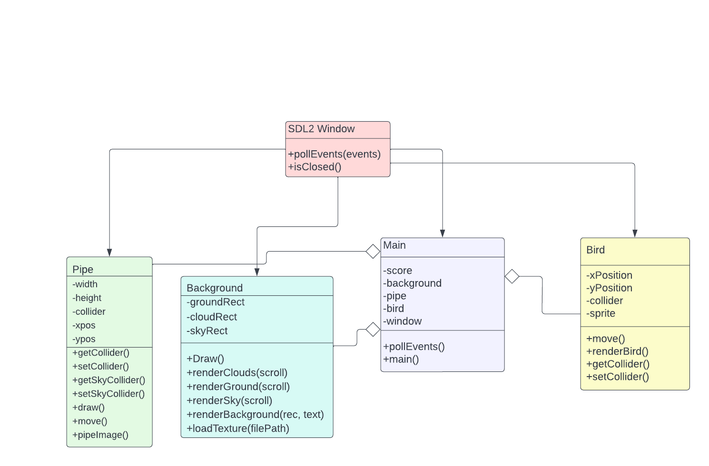
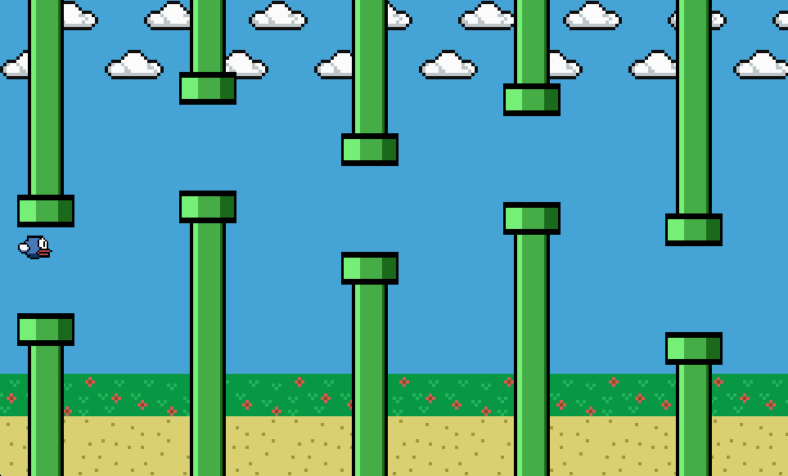
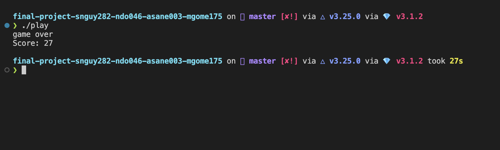

# Terminal Flappy Bird
 
 > Authors: [Aarav Sane](https://github.com/skyguy-netizen),
            [Sabien Nguyen](https://github.com/SabienNguyen),
            [Melanie Gomez](https://github.com/MelanieGz),
            [Nam Do](https://github.com/nayR0D)
            
 <!--
 > ## Expectations]: <>
 > * The backend of your project should be implemented in C++. If you wish to choose anoher programming language (e.g. Java, Python), please discuss with your lab TA to obtain permission.
 > * You can incorporate additional technologies/tools but they must be approved (in writing) by the instructor or the TA.
 > * Each member of the group **must** be committing code regularly and make sure their code is correctly attributed to them. We will be checking attributions to determine if there was equal contribution to the project.
 > * **Each member of the group must actively participate in the Github Project board, writing unit tests, and reviewing commited code.**
 > * All project phases are to be submitted to this GitHub repository. You should modify this README file to reflect the different phases of the project. In addition, you should regularly hold sprint meetings with your group. You will need to hold two to three scrum/check-in meetings with your lab TA/reader at different times in addition to the final demo.]: <> -->

## Project Description
> We will create a terminal-based flappy bird. Flappy bird was a fun game that we all have a lot of good memories with, and we wanted to recreate the game so we could replay it on our terminals. We are using C and C++ to code our project while using SDL2 Libraries to allow the us to construct a window that displays the game. The input of the project will be the up arrow and down arrow keys on the keyboard in order to make the bird jump up and down, respectively. The output will be a window that is ran when the user executes the program, displaying the graphics of the game. The score is given once the player loses. The player must attmept to survive as long as possible without colliding a pole.

>The project will feature one main gamemode where the player tries to last as long as they can without having their flappy bird get into contact with the pipe. Once the flappy bird gets into contact with a pipe then a game over message will appear with a display of their score in that run. The scoring is based off the amount of seconds the player survived. We will then ask the user if they would like to continue and play another round of the game.  We will also ensure that the flappy bird is within the bounds of the terminal by having the game over screen appear if the user had their flappy bird hit the ground or go out of the screen while jumping. This is to ensure that the movement is viewed at all times. Some elements we plan on incorporating if time permits is a feature that blast pipes. This feature would be similar to that of Space Invaders where flappy birds will shoot and try to hit a pipe enough times in order for it to destroy. This will give the player an option to either go through opening or destroy the pipe.

>Technology used:
> * [SDL2](https://www.libsdl.org/) - We used the SDL2 main and image libraries in order to be able to create a window to output our display with images. It provides a low level access to be able to constructs the game and allows cross platform production. 
> * [CMake](https://cmake.org/) - CMake allows us to compile and form executables of our code in order to allow the program to run and be tested.
> * [Googletest](https://github.com/google/googletest) - This subdirectory is included in our repository so we can run tests on our code.
> * [CMake Scripts](https://github.com/tcbrindle/sdl2-cmake-scripts) - We referenced this subdirectory to form our cmake files in order to allow SDL2 to be run on different platforms.

 
 ## Class Diagram
 
 > Every object now inherits from a SDL2 Window object which renders things to the screen or window. Every object is now initizlied with the window object which allows it to be rendered onto the screen. The window object also has a function called pollEvents(event) which constantly monitor for events like keyboard presses which then get processed and turned into actions like moving the bird up and down. The bird class has a position on the screen and a collider which is an SDL_Rect object that defines the bird's hurtbox. The Bird object also has a sprite which is rendered using the bird's renderBird() function. The Bird also has setter and getter functions for its collider so collisions can be detected in the game. The Bird's Move() function constantly polls events for the up key or down key and will move the Bird accordingly. Pipes is a similar class with positions, colliders, and sprites like the bird. The Pipe has a move() function but it constantly moves the pipes towards the bird. Pipes also have setter and getter functions for their colliders to detect for collisions with the bird. The pipe also has a draw() function which renders the sprite onto the window. Background simply has rectangles representing the background sprite's render surface. The render functions loads the texture on to the renderer and the draw() function actually draws the sprites onto the window using the renderer. Main contains all of the classed mentioned above and has an instance of a window object that is the actual game scree. It has a score int that keeps track of how long the bird lasts and a pollEvents() method inherited from window that constantly polls inputs.
  
 ## Screenshots
 
 
  
 ## Installation/Usage
 
 ### Terminal Flappy Bird Installation
> In order to get flappy bird onto your machine you must run the following commands using git.

    $ git clone "https://github.com/cs100/final-project-snguy282-ndo046-asane003-mgome175"
    $ cd final-project-snguy282-ndo046-asane003-mgome175
    
  ### SDL2 Installation
 >SDL2 and SDL2 image must be installed on your machine in order to run the program, find your respective machine and follow the installation steps to get them on your machine.
 
#### Installation on Mac

    $ brew install SDL2
    $ brew install SDL2_image

#### Installation on Linux
##### Debian Based

    $ sudo apt-get install libsdl2-dev
    $ sudo apt-get install libsdl2-image-dev
    $ sudo apt
    
     
### Usage
>Now we will run the program by using the shell script command in the terminal... 

    $ ./play.sh

>A window should appear with the game running. In order to move the bird, you will be using the up and down keys on the keyboard to have the bird move up and down on the screen, respectively. In order to escape while the game is running the user can press the escape key on their keyboard or exit through the window by pressing the exit button at the right hand corner.
 ## Testing
 > * We tested the project by adding the Googletest submodule and within the shell scipt command `cmake .` is called which forms the makefiles to allow an executable called runtests to run the unit tests within the test.cpp file. 
 > * We also used continuous integration so we have a git workflow in our repository to verify that each pull request made passes the automated build and tests before it is merged into the main branch.
 > * Please note that valgrind tests were unable to be applied to this project due to the installation of our GUI (SDL2 and its libraries) which formed errors when trying to run valgrind against the executable. 
 

